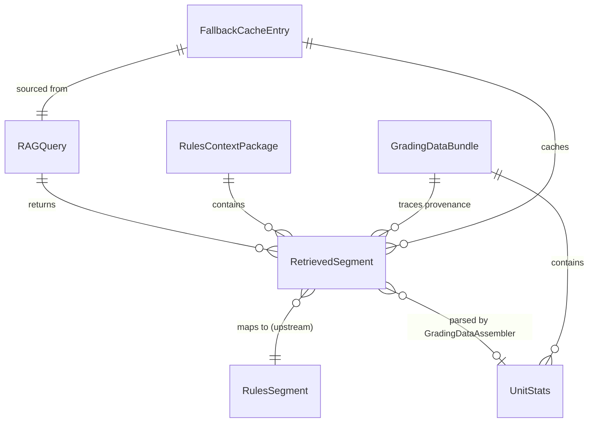

# Data Model: Oracle RAG Utilization

**Feature**: `002-oracle-rag-utilization`  
**Created**: 2026-02-23  
**Base class**: `VindictaModel` (see [R-004](file:///c:/Users/bfoxt/vindicta-playground/vindicta-oracle/specs/002-oracle-rag-utilization/research.md) for rationale)

---

## Upstream Models (Foundation — read-only)

These models live in `vindicta-foundation` and are consumed by the oracle via the MCP protocol serialization. The oracle does **not** import them directly; instead, it reconstructs equivalent Pydantic models from the MCP tool response JSON.

### RulesSegment

| Field | Type | Description |
|-------|------|-------------|
| `id` | `UUID` | Unique segment identifier (from `VindictaModel`) |
| `url` | `AnyUrl` | Source URL of the rule |
| `content_markdown` | `str` | Cleaned markdown rule text |
| `content_hash` | `str` | SHA-256 hex string for dedup |
| `version` | `int` (≥1) | Version counter per URL |
| `embedding` | `list[float]` | Ollama-generated vector (not transmitted over MCP) |
| `timestamp` | `datetime` | Time of ingestion |

### AgentQuery

| Field | Type | Description |
|-------|------|-------------|
| `id` | `UUID` | Query identifier |
| `query_text` | `str` (4-4096 chars) | Natural language search query |
| `agent_id` | `str` | Identifier of the calling agent |
| `timestamp` | `datetime` | Time of query |

---

## Oracle Models (New)

All new models in `vindicta-foundation/src/vindicta_foundation/models/rag_oracle.py` (exported via `__init__.py`). Inherit from `VindictaModel`.

### RAGQuery

Structured search request issued by the oracle to the MCP server.

| Field | Type | Default | Description |
|-------|------|---------|-------------|
| `unit_names` | `list[str]` | required | Unit names to search for |
| `query_type` | `QueryType` (enum) | required | One of: `unit_stats`, `weapon_profile`, `errata`, `meta_context` |
| `version_filter` | `int \| None` | `None` | Optional minimum version to retrieve |
| `agent_id` | `str` | `"oracle"` | Identifier for the requesting system |

**Enum: `QueryType`**

```
unit_stats | weapon_profile | errata | meta_context
```

### RetrievedSegment

A single result from the MCP `search_40k_rules` tool response, deserialized into the oracle's domain.

| Field | Type | Default | Description |
|-------|------|---------|-------------|
| `segment_id` | `UUID` | required | Maps to foundation `RulesSegment.id` |
| `content_markdown` | `str` | required | Raw markdown rule text |
| `relevance_score` | `float` | required | Distance/similarity from ChromaDB (lower = more relevant) |
| `version` | `int` | `1` | Version of this segment |
| `url` | `str` | required | Source URL |
| `retrieval_timestamp` | `datetime` | auto-generated | When the oracle retrieved this |

### UnitStats

Structured extraction of numeric unit data from raw markdown. Produced by `GradingDataAssembler`.

| Field | Type | Default | Description |
|-------|------|---------|-------------|
| `name` | `str` | required | Unit name |
| `points_cost` | `int` | required | Current points cost |
| `toughness` | `int` | required | Toughness characteristic |
| `wounds` | `int` | required | Wounds characteristic |
| `save` | `str` | required | Save characteristic (e.g., "3+") |
| `weapons` | `list[str]` | `[]` | List of weapon names |
| `abilities` | `list[str]` | `[]` | List of abilities/rules |
| `source_segment_id` | `UUID` | required | Provenance: which RAG segment this was parsed from |

### RulesContextPackage

Pre-assembled context distributed to debate agents for a session.

| Field | Type | Default | Description |
|-------|------|---------|-------------|
| `segments` | `list[RetrievedSegment]` | required | Included rule segments |
| `unit_coverage` | `dict[str, bool]` | required | Maps unit name → whether RAG returned results |
| `budget_total` | `int` | `32000` | Total character budget |
| `budget_used` | `int` | computed | Characters consumed by included segments |
| `retrieval_mode` | `RetrievalMode` (enum) | required | `live` or `cached` |

**Enum: `RetrievalMode`**

```
live | cached
```

### GradingDataBundle

Data bundle used by `ListGrader` for a single evaluation.

| Field | Type | Default | Description |
|-------|------|---------|-------------|
| `unit_data` | `dict[str, UnitStats]` | required | Unit name → parsed stats |
| `unresolved_units` | `list[str]` | `[]` | Units not found in RAG server |
| `provenance` | `dict[str, UUID]` | required | Unit name → source segment ID |
| `retrieval_mode` | `RetrievalMode` | required | `live` or `cached` |

### MetaSnapshot

Aggregate meta statistics for a faction (P3 — optional).

| Field | Type | Default | Description |
|-------|------|---------|-------------|
| `faction` | `str` | required | Faction name |
| `win_rate` | `float \| None` | `None` | Tournament win rate (0.0-1.0) |
| `popular_units` | `list[str]` | `[]` | Most commonly taken units |
| `meta_commentary` | `str` | `""` | AI-generated competitive assessment |

### FallbackCacheEntry

Internal cache row wrapper — not exposed in public APIs.

| Field | Type | Default | Description |
|-------|------|---------|-------------|
| `key` | `str` | required | Cache key (unit name or topic) |
| `segments` | `list[RetrievedSegment]` | required | Cached segments |
| `cached_at` | `datetime` | auto-generated | When the cache entry was written |
| `source_query` | `RAGQuery` | required | The query that produced these segments |

---

## Relationships



---

## Modified Existing Models

### DebateContext (existing)

Add field:

| Field | Type | Default | Description |
|-------|------|---------|-------------|
| `rules_context` | `RulesContextPackage \| None` | `None` | Pre-fetched RAG rules for this session |

### DebateTranscript (existing)

Add field:

| Field | Type | Default | Description |
|-------|------|---------|-------------|
| `rag_segments_used` | `list[str]` | `[]` | Segment IDs cited in the debate (FR-009) |

### GradeResponse (existing)

Add field:

| Field | Type | Default | Description |
|-------|------|---------|-------------|
| `meta_context` | `dict \| None` | `None` | Faction meta context from RAG (P3) |
